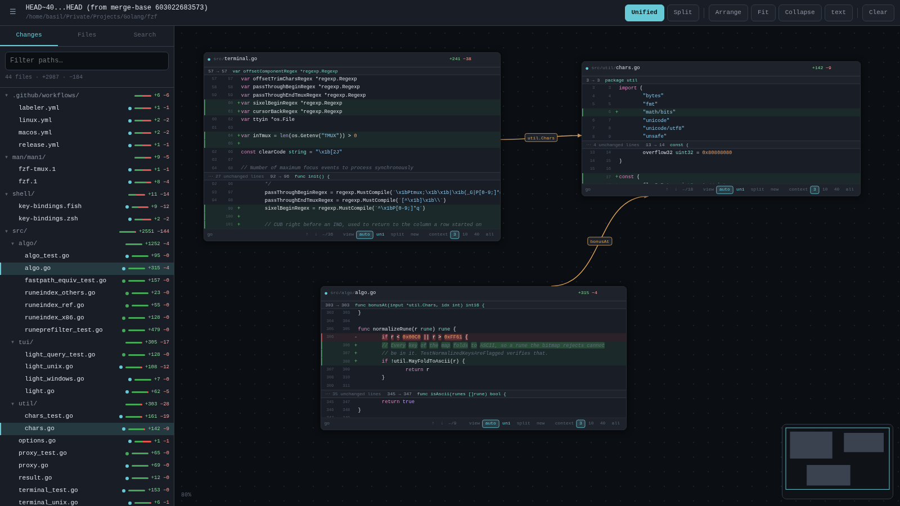
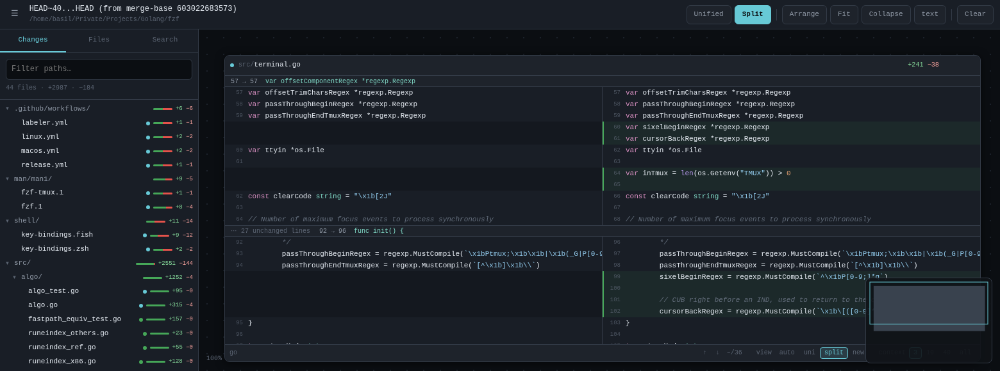
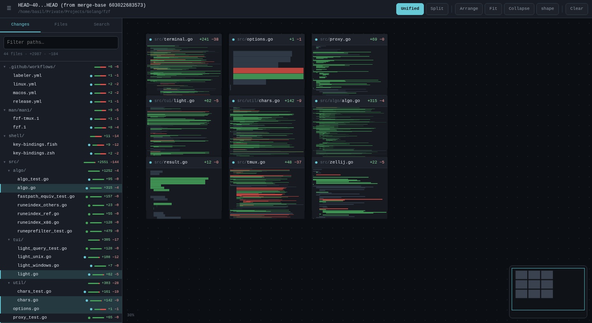

# diffcanvas

An infinite canvas for reading big pull requests. Import a git diff, spread the
files out in 2D, draw arrows between them, and see the whole change at once
instead of jumping between files one at a time.

Local only. One static binary, no runtime, no install, no network.

```sh
diffcanvas main...feature
```



## Why it works this way

A 50-file review is mostly a navigation problem, so the design optimises for
seeing the shape of a change and arranging it by hand.

- **A local server, not a generated HTML file.** File bodies, extra diff
  context, search and symbol lookup all load on demand. A pre-rendered file
  cannot do any of that, and embedding every body makes the page enormous — a
  1,604-file range ships a 244 KB change list instead of hundreds of megabytes.
- **Exact Go highlighting.** `go/scanner` from the standard library, so raw
  strings containing fake comments, block comments containing code, and unicode
  identifiers all colour correctly. ~25 other languages get a smaller
  table-driven highlighter.
- **Zero dependencies.** Nothing outside the Go standard library: no supply
  chain to vet, no proxy access needed to build, no npm anywhere near it.
- **Nothing leaves the machine.** Loopback only, a per-run token, and a
  Content-Security-Policy that forbids every outbound request.

## Install

```sh
go install github.com/vpohrebenko/diffcanvas/cmd/diffcanvas@latest
```

Or build it yourself:

```sh
git clone https://github.com/vpohrebenko/diffcanvas
cd diffcanvas
go build -o diffcanvas ./cmd/diffcanvas
```

Requires Go 1.22+ and `git` on `PATH`. Nothing else.

### Running it from WSL

Build for Linux, copy the one binary over, and run it *inside* WSL:

```sh
GOOS=linux GOARCH=amd64 CGO_ENABLED=0 go build -trimpath -ldflags="-s -w" ./cmd/diffcanvas
```

WSL2 forwards `localhost` to Windows, so the printed `http://127.0.0.1:PORT`
URL opens directly in the Windows browser — no path translation. A
`GOOS=windows` build also works if the repository lives on the Windows side.

## Choosing what to review

```
diffcanvas                 uncommitted changes
diffcanvas --staged        staged changes only
diffcanvas HEAD~3          one commit, against its first parent
diffcanvas main...feature  a branch, from its merge base
diffcanvas main..feature   direct diff between two revisions
diffcanvas -C /path/to/repo HEAD
```

`A...B` (three dots) is the right form for reviewing a branch: it diffs from
the merge base, which is what a pull request shows. `A..B` also includes
everything that landed on `main` after you branched — which is how a 50-file
review turns into a 200-file one.

| Flag | Effect |
| --- | --- |
| `-C <dir>` | run as if started in that directory |
| `--staged` | review staged changes |
| `-port <n>` | fixed loopback port (default: a free one). Useful for SSH tunnels |
| `-no-open` | do not launch a browser |

## Features

### Sidebar

| | |
| --- | --- |
| **Changes tab** | Directory *tree*, not a flat list. Single-child chains fold into one row (`src/main/java/com/foo/`). Per-file and per-directory rolled-up `+/−` counts and density bars. Status dot per file. |
| **Files tab** | Every tracked file, including ones the diff did not touch — for pulling in context. |
| **Search tab** | `git grep` across the repository. Clicking a hit opens the file **scrolled to that line**. |

Tree actions: **click** a file to open it · **drag** it onto the canvas to place
it exactly · **shift-click** to mark it reviewed (strikethrough) · type in the
filter to narrow (the tree auto-expands while filtering). Files already open are
highlighted.

### Canvas

| Gesture | Action |
| --- | --- |
| drag background | pan |
| **shift**+drag | marquee-select cards |
| wheel | zoom to cursor (8–300%) |
| click minimap | jump the viewport there |

### Cards

Hover a card to reveal its actions: **⧉ duplicate**, **− collapse**, **× close**,
a resize handle, and the connection ports on its edges. Drag the header to move
it. Duplicating opens the **same file any number of times**, each with its own
context level and scroll position — useful for comparing two ends of one file.

### Reading the diff



- **Unified / Split** (`u` / `s`), switched globally.
- **Context continuum** per card: `3 · 10 · 40 · all`. This is how much
  unchanged code surrounds each change. There is no diff/whole-file *mode* —
  "all" is simply maximum context, which is why **side-by-side keeps working at
  every step**.
- **Word-level diff.** When a line is replaced, only the words that actually
  changed are highlighted. Line-level colour stays a faint tint plus a solid
  edge bar, so saturated colour always means "this is the bit that changed".
- Hunk headers carry the enclosing function. Binary, truncated, renamed and
  deleted files are all handled explicitly, and "no newline at end of file" is
  shown.

### Seeing the whole change



Below 40% zoom, cards stop rendering text and become **density strips** showing
where the additions and deletions fall in each file, drawn at a fixed pitch so a
small tweak looks small next to a rewritten file. Card names and counts stay at
a constant on-screen size, so the overview is still navigable.

### Arrows

- **Manual:** hover a card, drag from the port on either edge onto another card.
- **Imports (`i`):** draws the real Go import edges between the open cards — one
  arrow per imported package, never into a `_test.go` file.
- **Ctrl-click an identifier:** opens its declaration as a new card and draws an
  arrow back to the call site, so following a chain of calls leaves a trail.

Click an arrow to select it, `Delete` to remove, double-click to label.

### Jump to definition (Go)

Ctrl-click (or Cmd/Alt-click) any identifier. Declarations are indexed with
`go/ast`; a qualified name resolves through the calling file's own imports, an
unqualified one prefers the caller's package.

Resolution is heuristic and says so. Each jump reports its confidence:

| Confidence | Meaning |
| --- | --- |
| `exact-package` | `pkg.Name` resolved via a real import of that file |
| `same-package` | declared in the caller's own package |
| `unique` | only one declaration of that name in the repository |
| `guess` | ambiguous; opens the best candidate and says how many others exist |

A qualifier belonging to the standard library or a dependency is **refused**
rather than matched to an unrelated local name of the same spelling. Full
accuracy would need `go/types` and a real build, which would mean a toolchain
and network access on the reviewing machine.

### Selection and layout

Marquee-select, then **Align** / **Collapse** / **Close** from the toolbar;
dragging any selected card moves them all. **Arrange** (`a`) tidies cards into
directory-sorted columns — the selection only, if there is one. **Fit** (`f`)
frames everything.

Your arrangement is saved automatically, per repository and revspec, and
restored when you reopen the same range. State lives in
`$XDG_STATE_HOME/diffcanvas` (never inside your repository); delete it to reset.

### Keys

| Key | Action |
| --- | --- |
| `f` | fit everything in view |
| `a` | arrange into columns |
| `c` | collapse / expand all |
| `u` / `s` | unified / split |
| `i` | draw Go import arrows |
| `ctrl`+click | jump to definition |
| `shift`+drag | marquee select |
| `/` | focus the path filter |
| `\` | toggle the sidebar |
| `ctrl`+`a` | select all cards |
| `Delete` | remove selected arrow or cards |
| `Esc` | deselect |

## Security

The code under review is frequently confidential, so:

- Listens on `127.0.0.1` only — never the wildcard address — on an ephemeral
  port by default.
- A random 32-byte token per run. Repository data (`/api/*`) is served only to
  requests carrying it in a **header**, which a page on another origin cannot
  set without a CORS preflight that is never granted. The page and its own
  assets additionally accept a `SameSite=Strict` cookie, because browsers
  cannot attach headers to `<link>` and `<script src>` fetches.
- Non-loopback `Host` headers are refused, which defeats DNS rebinding.
- A Content-Security-Policy forbids every outbound request, so a bug cannot
  become an exfiltration path.
- All file content is rendered via `textContent`; a repository containing
  markup can never have it executed.
- Paths are validated and symlinks resolved before any read, so a tracked
  symlink cannot be used to read outside the repository.
- No CDN, no fonts, no telemetry, no update check. The only subprocess is
  `git`, in the repository you pointed it at.

To reach it from another machine, use an SSH tunnel — deliberately:

```sh
diffcanvas -port 8477 -no-open        # on the remote host
ssh -L 8477:127.0.0.1:8477 user@host  # locally, then open the printed URL
```

## Development

```sh
go test ./...
go vet ./...
```

See [CLAUDE.md](CLAUDE.md) for architecture, invariants and the traps that are
easy to reintroduce.

## Licence

MIT — see [LICENSE](LICENSE).
